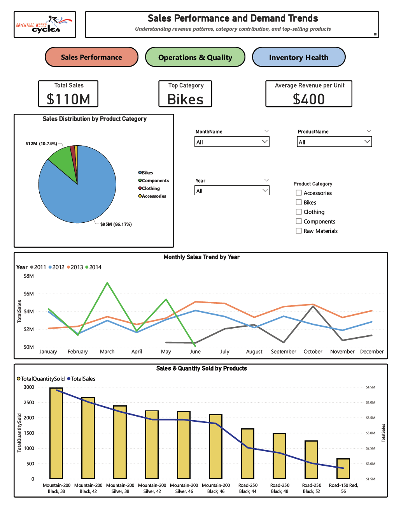
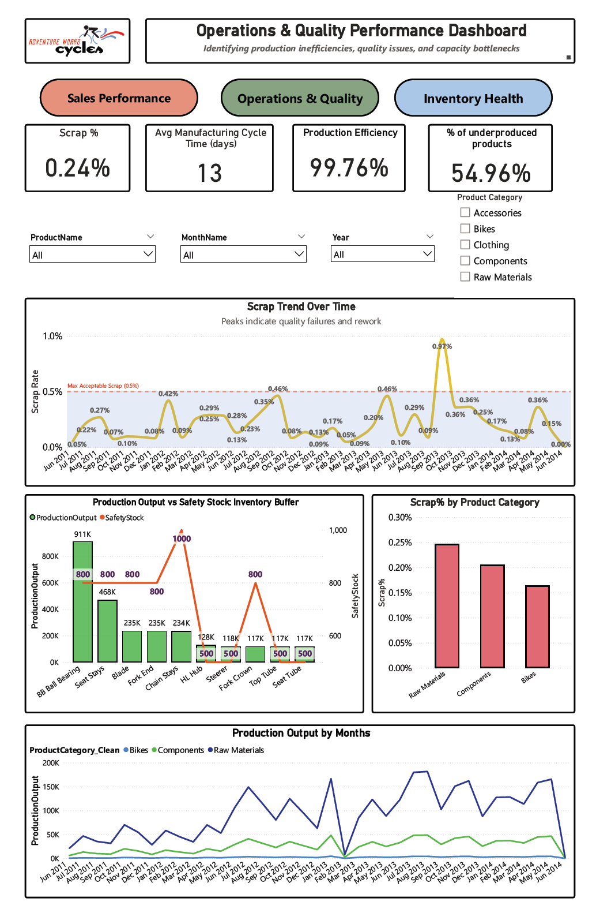

# AdventureWorks BI Project  
## Understanding Sales Demand and Production Bottlenecks

**Tools:** SQL Server (SSMS), Power BI, DAX  
**Focus:** Sales trends, production efficiency, operational bottlenecks  

---

## Why I Did This Project

I worked on this project as part of my learning journey in Business Intelligence, with
the goal of understanding how **sales demand, production performance, and quality issues**
are connected in a real business scenario.

Instead of looking at dashboards separately, I tried to answer one core question:

**Where is the business losing revenue, and what operational issues could be causing it?**

To approach this, I focused on two closely related areas:
- Sales performance and demand behavior  
- Production efficiency and quality performance  

Looking at these together helped me move beyond “what the numbers say” and start thinking
about *why* certain patterns appear.

---

## Data Preparation & Modeling (SQL → Power BI)

Before building anything in Power BI, I spent time preparing the data in
**SQL Server Management Studio (SSMS)**. This was an intentional choice, as I wanted to
practice building a clean analytical foundation instead of relying heavily on
transformations inside Power BI.

Using SQL, I:
- Selected only the fields needed for analysis  
- Removed redundant columns and duplicate keys  
- Standardized date fields and product categories  
- Ensured consistent keys (`ProductID`, `DateKey`) across tables  
- Created a monthly aggregation to analyze sales trends over time  

### SQL Views Used

#### Fact tables (SQL views)
- `vFactSales` – sales revenue, quantities, and order dates  
- `vFactWorkOrder` – production volume, scrap quantity, and manufacturing time  
- `vFactPurchasing` – purchasing activity and supplier-related information  
- `MonthlySales` – custom SQL view aggregating sales by month and year  
- `vFactInventory` – inventory quantities and stock status (explored but not used in the final analysis)

#### Dimension tables (SQL views)
- `vDimProduct` – product attributes with cleaned and standardized categories  
- `vDimDate` – calendar table for time-based analysis  
- `vDimCustomer` – customer-level attributes  
- `vDimTerritory` – geographic sales territory hierarchy  
- `vDimAddress` – address-level geographic information  
- `vDimVendor` – supplier and vendor attributes  

Preparing these views in SQL helped reduce complexity later in Power BI. All views were
cleaned and standardized to keep relationships consistent and to minimize transformation
logic in the BI layer.

Not all prepared views were used directly in the final dashboards, but creating them
helped me understand the full data model and ensured the Power BI schema was extensible
and logically consistent.

---

## Power BI Data Model

Once the SQL views were imported, I built a **star-schema style data model** in Power BI.
Designing the model correctly was one of the main learning goals of this project.

**Fact tables:**
- Sales (`vFactSales`)  
- Work Orders (`vFactWorkOrder`)  
- Monthly Sales (`MonthlySales`)  
- Purchasing (`vFactPurchasing`)  
- Inventory (`vFactInventory`)  

**Dimension tables:**
- Product (`vDimProduct`)  
- Date (`vDimDate`)  
- Customer (`vDimCustomer`)  
- Territory (`vDimTerritory`)  
- Vendor (`vDimVendor`)  

### Key Modeling Decisions

- Used **single-direction relationships** from dimensions to fact tables to avoid ambiguity  
- Connected `vDimDate` to both sales and production to maintain a consistent time axis  
- Linked all fact tables through `ProductID` to enable cross-functional analysis  
- Cleaned product categories to remove blanks and inconsistencies  

I then created DAX measures for:
- Year-over-Year (YoY) and Month-over-Month (MoM) trends  
- Scrap rate and production efficiency  
- Basic demand indicators  

This model allowed me to analyze **sales demand, production bottlenecks, and quality
performance together** without running into incorrect totals or confusing filters.

---

## What I Learned from the Sales Dashboard

*Figure 1. Sales performance dashboard showing revenue concentration in Bikes, seasonal demand patterns, and product-level differences between sales volume and revenue contribution.*

**Key metrics observed:**
- **Total sales:** approximately **$110M**
- **Bikes contribute around 86% of total revenue**
- **Average revenue per unit:** roughly **$400**

**Key insights:**

- Revenue is heavily concentrated in Bikes, which means any production or quality issue
  affecting this category has an immediate and significant impact on overall revenue.
- Sales follow clear **seasonal patterns**, with strong peaks between **March–June** and
  again in **Q4**, and weaker demand during summer months.
- Some months show very large **YoY changes (300–500%+)**, which often occur because the
  prior-year values are extremely low rather than due to genuine explosive growth.
- At the product level, there is a noticeable mismatch between **quantity sold and revenue
  generated**. Some products sell in high volumes but contribute relatively little revenue,
  while others generate high revenue with fewer units sold.

These observations helped me better understand demand volatility and why accurate
forecasting and product mix decisions are critical.

---

## What I Learned from the Production & Quality Dashboard

*Figure 2. Production and quality dashboard highlighting scrap rate variability, manufacturing cycle time, and underproduction relative to safety stock.*

**Key operational metrics:**
- **Average scrap rate:** about **0.24%**
- **Scrap spikes:** reaching **0.6–0.9%** in certain months  
- **Average manufacturing cycle time:** around **13 days**
- **Production efficiency:** approximately **99.76%**
- **Products underproduced relative to safety stock:** about **55%**

**Key insights:**

- Although the average scrap rate looks low, the recurring spikes suggest periods of
  quality instability, rework, and production stress; often during high-demand months.
- The average cycle time of 13 days indicates relatively long lead times, which limits
  how quickly production can respond to seasonal changes in demand.
- High production efficiency can be misleading, as it hides issues such as the
  **underproduction of high-demand items** and imbalance across product categories.
- When looking at scrap by category, **components show the highest scrap rates**, followed
  by Bikes, while Accessories appear more stable. This helps identify where quality
  improvements could have the biggest impact.

---

## Why I Did Not Include Inventory Analysis

I initially intended to include an inventory dashboard, but while exploring the data,
I realized that AdventureWorks inventory is stored at **bin and shelf level** and mixes:
- Raw materials  
- Components  
- Small hardware items  

Because of this structure, the data does not accurately represent finished-goods
inventory. Including it would likely lead to misleading conclusions about overstock and
stockouts.

Instead of forcing an unreliable analysis, I chose to focus on **sales and operations**,
where the data supports clearer and more meaningful insights. This decision was an
important learning experience in maintaining analytical integrity.

---

## Putting Everything Together

When combining the dashboards, a clear pattern emerges:

- Demand is **seasonal and volatile**
- Production struggles to adjust smoothly due to long cycle times and quality issues
- Scrap spikes reduce available output during critical periods
- Underproduction of high-demand items leads directly to **missed sales opportunities**

At the same time, production resources are not always aligned with the products that
generate most of the revenue.

---

## What This Project Taught Me

This project showed me that Business Intelligence is more than just creating visuals.
It involves:
- Asking meaningful business questions  
- Preparing and modeling data carefully  
- Interpreting metrics in context rather than in isolation  

Most importantly, it helped me understand how **operational constraints directly affect
revenue**, and how BI can be used to uncover those relationships in a practical way.
